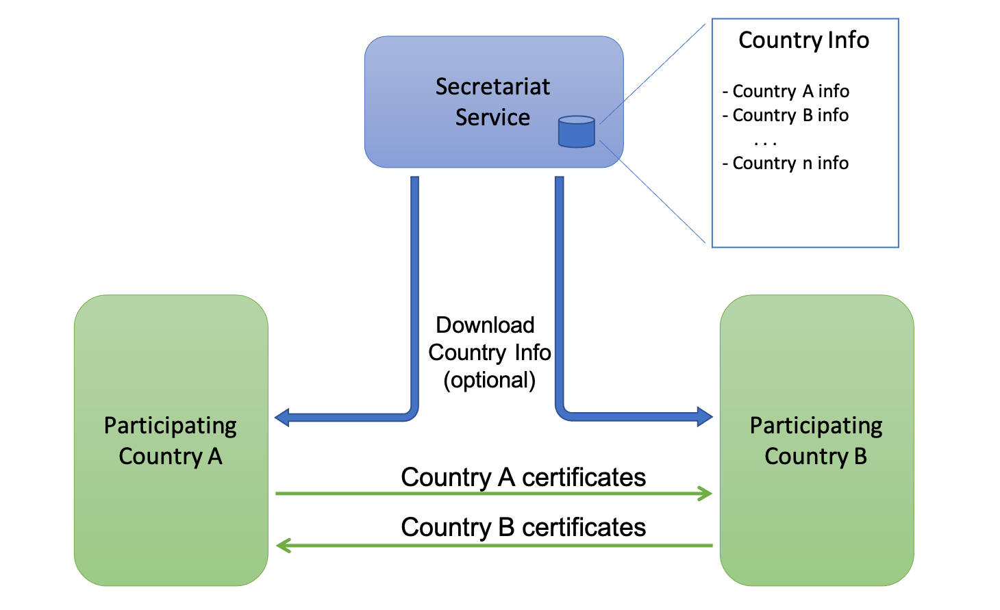

# Electronic Health Certificate Trust Exchange Specification

Version 0.0.1-draft, 2021-04-15

## Abstract

This document specifies a basic service model and data exchange formats for an initial infrastructure for trust information exchange to support validation of electronic health certificates (HCERTs).

### Version History

| version | status | Comments |
|----------|----------|----------|
| 0.0.1  | draft | first version |

## Terminology

Organisations adopting this specification for issuing health certificates are called Issuers and organisations accepting health certificates as proof of health status are called Verifiers. Together, these are called Participants. Issuers are registered under a country and Verifiers are assumed to be operating within a country infrastructure, relying on a national Trust Point for retrieving the information necessary to validate the authenticity of HCERTs issued by other countries. The national Trust Points are operated by a competent appointed authority of that country. Countries operating together to form this infrastructure of trust are called Member States. Some aspects in this document must be coordinated between the Member States, such as the management of a namespace and the distribution of cryptographic keys. It is assumed that a function, hereafter referred to as the Secretariat, carries out these tasks.

The key words "MUST", "MUST NOT", "REQUIRED", "SHALL", "SHALL NOT", "SHOULD", "SHOULD NOT", "RECOMMENDED", "NOT RECOMMENDED", "MAY", and "OPTIONAL" in this document are to be interpreted as described in BCP 14 ([RFC2119](https://tools.ietf.org/html/rfc2119), [RFC8174](https://tools.ietf.org/html/rfc8174)) when, and only when, they appear in all capitals, as shown here.

### Versioning Policy

Versions of this specification follow [semantic versioning](semver.org) and consist of three different integers describing the _major_, _minor_ and _edition_ version. A change in the _major_ version is an update that includes material changes affecting the interoperability among the Participants and the Member States. An update of the _minor_ version is a feature or maintenance update that maintains backward compatibility with previous versions.

In addition, there is an _edition_ version number used for publishing updates to the document itself which has no effect on the interoperability, such as correcting spelling, providing clarifications or addressing ambiguities, et cetera. The version numbers are expressed in the title page of the document using a _major.minor.edition_ format, where the three parts are separated by decimal dots.

## Introduction

The trust model for this specification is based on the ICAO Master List concept with a number of key simplifications which are made possible (as in the WHO proposal) due to the use of a HCERT-specific set of trusted certificates.

There are two distinct areas of trust exchange in this trust model:

   1. Those between the Member States managing Trust Points that is the concern of this document, and
   2. Those between each Verifier and its national Trust Point.

It is assumed that the latter relation is entirely up to the Member State in which the Verifier operates to manage. Once a Verifier has received a compiled a list if Issuers it is willing to trust, it only needs to maintain the accuracy of this list be regularly updating it against the Trust Point.

### Certificate trust model

HCERTs are verified using a Document Signer Certificate (DSC) that holds the public key of the document signer that issued the HCERT. A DSC is always signed by a Certificate Signing Certificate Authority (CSCA).

Each Member State MUST provide a list of one or more CSCA certificates used to sign certificates on that Member State's DSC list.

Each Member State MUST also provide a list of all valid Document Signing Certificates (DSCs), and keep this list current. This list is called the DSC list. All public keys within certificates present on the DSC list is considered valid for validating signatures of HCERTs from that Member State. Other Member States MAY use the list of CSCA certificates as an instrument to validate the certificates on the DSC list before accepting these DSCs for publication in the Trust Point.

### Certificate profiles

Requirements on certificate content of DSC and CSCA certificates are defined in the [Electronic Health Certificate (HCERT) Specification](https://github.com/ehn-digital-green-development/hcert-spec/blob/main/hcert_spec.md).

## Certificate exchange model

### Basic concept

The Secretariat maintains a list of Member States and the following information for each national Trust Point:

- URLs to the downloadable certificate sets (DSC and CSCA certificates)
- Information about how to authenticate the Trust Point and the downloaded certificates
- A current aggregated list of CSCA certificates
- A current aggregated list of verified DSC certificates

This information can be downloaded and authenticated by other Member States using the Secretariat's master URL and master key. This master key and master URL is the only information that is required to bootstrap trust in all HCERTs issued by all Member States.

All trust information is provided openly and freely without restrictions. Each Member State as well as the Secretariat service MUST provide the means to authenticate the downloadable data, but MUST NOT require authentication or authorisation of the downloading client.

Member States MAY choose between two different methods to obtain the aggregated sets of trusted certificates used to verify the signatures of HCERTs Issued in other Member States, as described below.

#### Downloading the aggregated list of certificates from Secretariat service

In this option the Member State simply downloads the compiled list of DSCs and optionally also the CSCA certificates aggregated and validated by the Secretariat. This is considered to be the default method to obtain the trusted DSCs for all Member States. As the aggregated DSC list is kept current and validated by the Secretariat service, Member States MAY choose to just download the DSC list and to consider all certificates on this list as trusted without doing explicit certificate validation against the signing CSCA.

#### Bilateral download

In this option the Member State obtains from the Secretairat service the URLs and authentication data used to download and authenticate certificates from other Member States directly. As an alternative to this initial step, the Member State MAY also obtain the information related to the foreign Trust Point directly from the other Member State. This pattern MAY be considered an option for a Member State to extend trust bilaterally to other countries which are not Member States.

The Member State then uses the verified Trust Point data to continously aggregate trusted certificates through direct bilateral downloads.

### Data formats

This specification defines two supported formats for providing a list of certificates. DSC and CSCA certificates MUST be provided in separate lists made available using separate URLs. The two supported formats are:

- A text document containing an unsigned list of concatenated PEM formatted certificates (ref)
- A signed set of JSON web keys ([RFC7517](https://tools.ietf.org/html/rfc7517))

All Issuing Countries MUST provide a list of PEM formatted certificates, and MAY provide a signed set of JWKs for each type of certificates they publish (DSC and CSCA certificates).

Each data format and each certificate type MUST be published through a separate URL.

### Data integrity and data origin authentication

Basic data integrity and data origin authentication SHALL be provided by using TLS version 1.2, or higher, with strong cipher suites that meet or exceed SOGIS (https://www.sogis.eu) contemproary standards. The TLS certificate used by each Participating Country SHALL be provided by the Secretariat via the master URL.

The key used to verify any present signed set of JWKs SHALL be provided by the Secretariat via the master URL.

## Secretariat trust information exchange service

The Secretariat offers information about Member State's Trust Points via the master URL. The following information is provided for each Country:

- URL for downloading a list of PEM formatted DSCs
- URL for downloading a list of PEM formatted CSCA certificates
- URL for downloading a signed set of JWKs containing DSCs (Optional)
- URL for downloading a signed set of JWKs containing CSCA certificates (Optional)
- TLS Certificate used on the origin server of above.
- Certificate for verifying signed JWKs (Optional)
- Current valid list of aggregated CSCA Certificates
- Current valid list of aggregated and validated DSC

The manner in which the Secretariat bootstrap initial URLs and certificates used to download and authenticate information from each Member State is outside the scope of this specification.

## Security considerations

This specification relies on Transport Layer Security (TLS) as the fundamental layer of protection with regard to the authenticity, integrity and accuracy of data and to prevent data substitution and replay attacks.

In cases where data is obtained using a signed set of JWKs, verifiers MAY ignore the TLS protection and rather depend on protection on the message layer. For this reason, it is important that signed data is provided with time of issue in order to prevent replay attacks where an adversary attempts to serve outdated trust information.

### Future migration

The infrastructure specified in this specification is expected to be a temporary solution and its design is focused on allowing Member States to use the system with a minimum amount of effort and development using currently available standard tools.

One important design goal is therefore to adopt a design that allows this model to be migrated into almost any future model for trust exchange such as

- A fully integrated key exchange gateway where Member States actively uploads trust information to the gateway using suitable APIs for trust management.
- Integration with existing trust infrastructures such as the ICAO trust infrastructure for passport validation.

 ## Normative Standard Bodies

 * SOGIS https://www.sogis.eu; at the time of writing _"SOG-IS Crypto Evaluation Scheme Agreed Cryptographic Mechanisms"_  version 1.2 of January 2020 (generally updates every 2 years) https://www.sogis.eu/documents/cc/crypto/SOGIS-Agreed-Cryptographic-Mechanisms-1.2.pdf

 _________________

 - Stefan Santesson, iDsec Solutions AB
 - Fredrik Ljunggren, Kirei AB.
 - Dirk-Willem van Gulik - For the Ministry of Public Health of the Netherlands

 [![CC BY 4.0][cc-by-shield]][cc-by]

 This work is licensed under a
 [Creative Commons Attribution 4.0 International License][cc-by].

 [![CC BY 4.0][cc-by-image]][cc-by]

 [cc-by]: http://creativecommons.org/licenses/by/4.0/
 [cc-by-image]: https://i.creativecommons.org/l/by/4.0/88x31.png
 [cc-by-shield]: https://img.shields.io/badge/License-CC%20BY%204.0-lightgrey.svg
